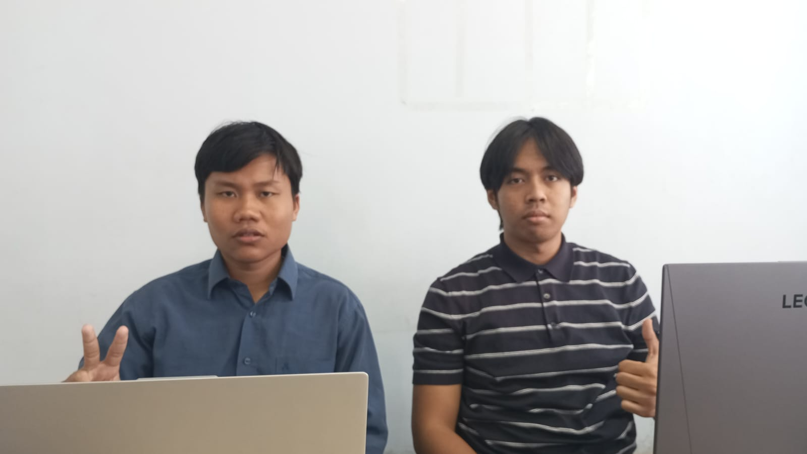
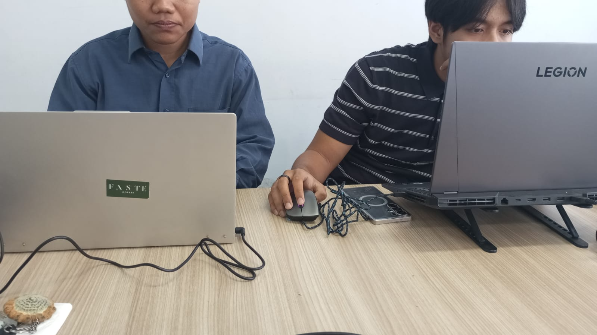

# NAME: Bagas Satrio Wicaksono
## Question Test
### Explain the difference between object and class!
Object: Sequence of program which consists of state and behavior.
Class: Blueprint or prototype from object.
### State your reason why gear and brand can be classified as attribute for Bike object!
Because Gear and brand are universal and exists in all of bikes.
### State one of OOP better point than procedural programming!
Because it avoids repetitive code
### Is it allowed to define two attributes in one line code such “public String name, address;”?
Yes, in this case, both name and address will have a String datatype.
### In RoadBike class, state your reason why brand, speed, and gear attributes are not written again in this class!
Because RoadBike inherits those attributes from the Bike class.

## Assignment
<h3>Follow these instructions to make your practical assignment is performed systematically:</h3>

- ### Take 4 photographs of objects around you, 2 objects must be implementation of inheritance concept, example: refrigerator, chair, living room table, desk! As we know that living room table and desk are inherited by table class
  
  
- ### Observe those objects to define the attribute and method!
- ### Convert those objects into four classes in Java programming!
- ### Add one additional class as a class which inherits its attribute and method to living room table class and desk class!
- ### Add two attributes for each class!
- ### Add three methods for each class including a method for showing the information!
- ### Add one class named Demo for main class!
- ### Instance an object for each class!
- ### Apply each method for each object in main class!
- ### The example which is mentioned in point 1.a should not be included in your task!

## Demo Code

Below is the `AssignmentDemo.java` used to instantiate objects and exercise each class' methods (also included in the `assignment` package):

```java
package assignment;

public class AssignmentDemo {
  public static void main(String[] args) {
    KalimantanPeople Atha = new KalimantanPeople("Atha", 170, 69, 20);
    BatuPeople Rayyan = new BatuPeople("Rayyan", 167, 67, 19);

    Atha.setPetSize(3);
    Rayyan.setGardenSize(25);

    GamingLaptop lenovoLegion = new Laptop("Lenovo", 15.6F, "3840 x 2160", "Mechanical");
    WorkLaptop lenovoIdeapad = new Laptop("Lenovo", 12.4F, "1920 x 1080", "Chiclet");

    lenovoLegion.setFanSpeed(4200);
    lenovoIdeapad.setSDCardReadingSpeed(95);

    System.out.println("--- Humans ---");
    Atha.printInfo();
    Atha.pet();
    Atha.fly();

    System.out.println();
    Rayyan.printInfo();
    Rayyan.harvest();
    Rayyan.plant();

    System.out.println();
    System.out.println("--- Laptops ---");
    lenovoLegion.printInfo();
    lenovoLegion.switchGPU();
    lenovoLegion.turnOnRGB();

    System.out.println();
    lenovoIdeapad.printInfo();
    lenovoIdeapad.insertSDCard();
    lenovoIdeapad.takeOutSDCard();
  }
}